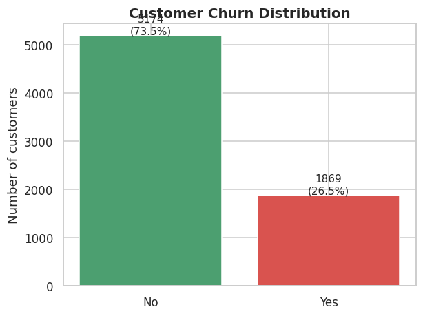
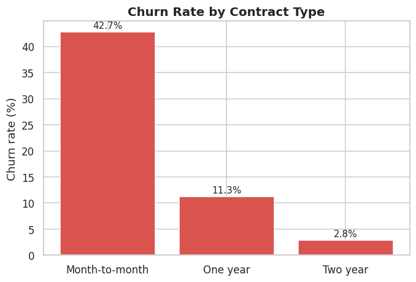
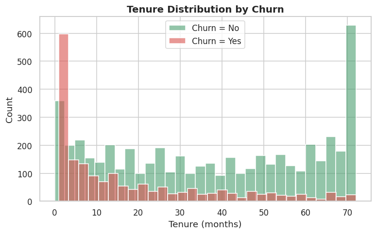
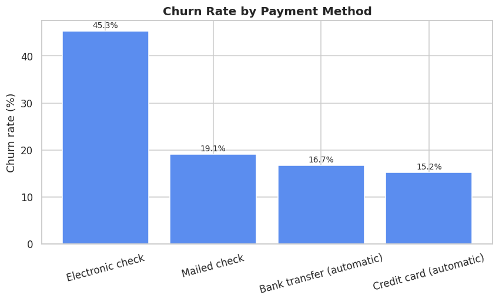
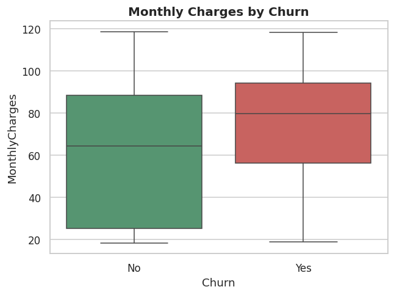
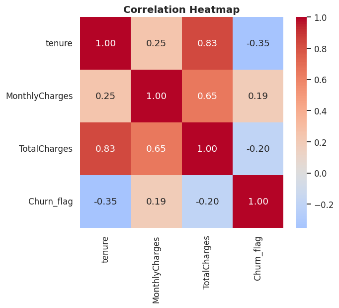

# 📊 Telco Customer Churn Analysis

> Identifying **why telecom customers leave** and what the business can do to keep them — using EDA, statistics, and statistical hypothesis testing on 7,043 real customer records.

   

---

## 🚀 1. Project Overview

A telecom company is losing roughly **1 in 4 customers**. Each lost customer means lost recurring revenue and higher acquisition costs to replace them.

This project follows a complete data-analyst workflow — **Data Cleaning → Exploratory Data Analysis → Statistics → Statistical Tests → Business Insights** — to answer one question:

> **Which customers churn, why, and what actions reduce it?**

---

## 🎯 2. Business Objectives

1. Measure the overall churn rate and find the most at-risk customer segments.
2. Quantify which factors (contract, payment, services, price, tenure) drive churn.
3. **Statistically confirm** that the patterns are real, not random noise.
4. Turn the findings into concrete, prioritized business recommendations.

---

## 📂 3. Dataset Information

| Item | Detail |
|------|--------|
| Source | Telco Customer Churn (IBM sample dataset) |
| Rows | 7,043 customers |
| Columns | 21 (demographics, services, account info, churn label) |
| Target | `Churn` (Yes / No) |

**Key columns:** `tenure`, `Contract`, `MonthlyCharges`, `TotalCharges`, `InternetService`, `PaymentMethod`, `TechSupport`, `OnlineSecurity`, `SeniorCitizen`.

---

## 🛠️ 4. Technologies Used

- **Python 3** — core language
- **Pandas / NumPy** — data cleaning & manipulation
- **Matplotlib / Seaborn** — visualization
- **SciPy** — statistical tests (Chi-Square, T-Test, ANOVA, Pearson)
- **Jupyter Notebook** — analysis & reporting

---

## 🧹 5. Data Cleaning Process

Three issues were fixed before analysis:

1. **`TotalCharges`** was stored as text with 11 blank values (brand-new customers, `tenure = 0`) → converted to numeric and filled with `0`.
2. **`SeniorCitizen`** was coded as `0/1` → mapped to `No/Yes` for readability.
3. **`customerID`** dropped (identifier with no analytical value).

Result: a clean dataset with **no missing values** and consistent data types.

---

## 📈 6. Exploratory Data Analysis (EDA)

- **Overall churn rate: 26.5%** — an imbalanced problem, so the focus is on segments that churn *above* this baseline.
- Churned customers are concentrated in their **first months** of tenure.
- Churned customers have **higher monthly bills** (74.4 vs 61.3 on average).
- Churn rate varies dramatically by **contract type, payment method, and internet service**.

---

## 💡 7. Key Business Insights

| # | Finding | Number |
|---|---------|--------|
| 1 | Overall churn rate | **26.5%** |
| 2 | Month-to-month contracts churn far more | **42.7%** vs 2.8% (2-year) |
| 3 | Electronic-check payers are the highest risk | **45.3%** churn |
| 4 | Fiber optic customers churn heavily | **41.9%** |
| 5 | No Tech Support / No Online Security → high churn | **~42%** each |
| 6 | Senior citizens churn more | **41.7%** vs 23.6% |
| 7 | Churned customers leave early | avg **18 months** vs 38 |

### 🔬 Statistical Test Results

| Test | What it compares | Result |
|------|------------------|--------|
| Chi-Square | Contract vs Churn | p ≈ 5.9e-258, Cramér's V = **0.41** (strongest) ✅ |
| Chi-Square | InternetService / PaymentMethod / TechSupport / OnlineSecurity vs Churn | all p < 0.001 ✅ |
| T-Test | MonthlyCharges (churn vs stay) | t = 18.4, p < 0.001 ✅ |
| T-Test | tenure (churn vs stay) | t = -34.8, p < 0.001 ✅ |
| ANOVA | MonthlyCharges across contract types | F = 20.8, p < 0.001 ✅ |
| Pearson | tenure vs TotalCharges | r = **0.83**, p < 0.001 |

*(✅ = statistically significant at p < 0.05)*

---

## 📊 8. Visualizations

| Churn Distribution | Churn by Contract |
|---|---|
|  |  |

| Tenure by Churn | Churn by Payment Method |
|---|---|
|  |  |

| Monthly Charges by Churn | Correlation Heatmap |
|---|---|
|  |  |

---

## 🧭 9. Business Recommendations

1. **Move customers to longer contracts** — incentivize month-to-month users to switch to 1–2 year plans (churn drops from 42.7% to 2.8%). This is the single biggest lever.
2. **Push auto-pay over electronic check** — automatic bank/card payment churn is ~15%, vs 45% for electronic check.
3. **Strengthen first-6-month onboarding** — most churn happens early in the customer life.
4. **Bundle Tech Support & Online Security** — customers without them churn ~3× more.
5. **Audit fiber optic pricing & quality** — high revenue but high churn = lost lifetime value.

---

## 📁 10. Project Structure

```
telco-churn-analysis/
├── data/
│   └── Telco-Customer-Churn.csv      # raw dataset
├── notebooks/
│   └── churn_analysis.ipynb          # full analysis (run & rendered)
├── images/                           # exported charts
│   ├── 01_churn_distribution.png
│   ├── 02_tenure_by_churn.png
│   ├── ...
│   └── 07_correlation_heatmap.png
├── analysis.py                       # standalone analysis script
├── requirements.txt
└── README.md
```

---

## ▶️ 11. How to Run

```bash
# 1. Clone the repository
git clone https://github.com/memmedzadev81-max/telco-churn-analysis.git
cd telco-churn-analysis

# 2. Install dependencies
pip install -r requirements.txt

# 3. Option A — run the script (regenerates all charts)
python analysis.py

# 3. Option B — open the notebook
jupyter notebook notebooks/churn_analysis.ipynb
```

---

## 👤 12. Author

**Vusal Mammadzade** — Data Analyst
- GitHub: [memmedzadev81-max](https://github.com/memmedzadev81-max)
- Kaggle: [profile](https://www.kaggle.com/)

*Built as part of my data analytics portfolio. Feedback welcome!*
